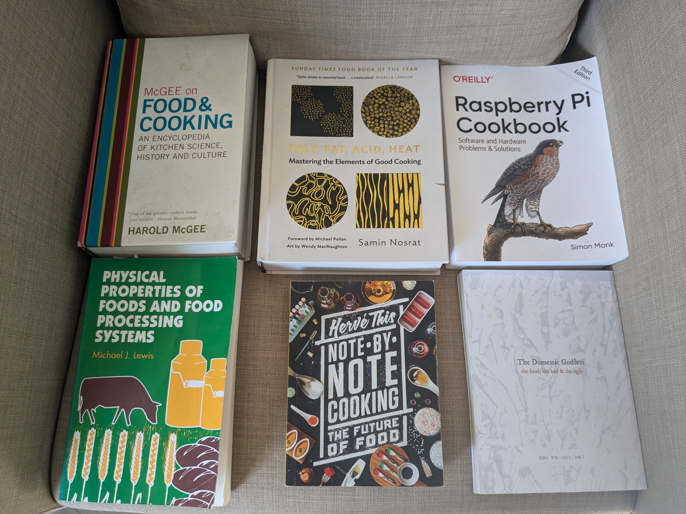

# Recipes & Software

Connecting recipes, code and documentation

<div class="pt-12">
  <span @click="$slidev.nav.next" class="px-2 py-1 rounded cursor-pointer" hover="bg-white bg-opacity-10">
    Shane Crowley | Technical Author @ Canonical
  </span>
</div>

<!--
Documentation is often talked about as a kind of "recipe".

In this talk, I want to explain this mapping and explore it further.

My goal is to prompt new thinking about documentation.
-->


---
transition: fade-out
---

# Some ideas to start

<v-clicks>

- 🧠 **Metaphor** - recipes are a common metaphor for documentation
- 🤷 **Ambiguity** - recipes can work, even when ambiguous or imprecise
- 🥇 **Effectiveness** - recipes must generate enjoyment to be effective
- 🔧 **Recipes-as-code** - recipes have their own markup and tooling

</v-clicks>

<v-click>

  <br>
  <hr>
  <br>

  <AutoFitText :max="20" :min="10" modelValue="As a food science PhD with a philosophy degree working in software,"/>
  <AutoFitText :max="20" :min="10" modelValue="I am uniquely qualified to wildly speculate about this one topic 😂 ..."/>

</v-click>

<style>
h1 {
  background-color: #2B90B6;
  background-image: linear-gradient(45deg, #4EC5D4 10%, #146b8c 20%);
  background-size: 100%;
  -webkit-background-clip: text;
  -moz-background-clip: text;
  -webkit-text-fill-color: transparent;
  -moz-text-fill-color: transparent;
}
</style>

<!--
The talk will frequently move between food and software.

To start, I want to mention some key points that will come up.
-->

---
layout: center
title: cooking books
---

## Cookbooks

{width=500px lazy}

Many kinds: traditional, scientific, industrial, artistic, ...

<!--
These are all examples of what we might call "cookbooks".

They all, however, deviate from the traditional idea of a cookbook.

One uses recipes as a means of artistic expression.

Another refers to the design of industrial food operations.
-->

---
layout: two-cols
layoutClass: gap-16
transition: fade
title: recipe types
---

## Traditional recipe...

{width=450px lazy}

<v-click>

## Technical method...

{width=300px lazy}

</v-click>

::right::

<v-click>

## Explanatory text...

{width=300px lazy}

</v-click>

<!--
This is closer to the traditional idea of a recipe.
It's notably terse, only focusing on the necessary steps.
An important feature of this recipe is that it is filled
with ambiguities:

- "good shape"
- "boil gently"
- "sufficient butter"

Below this we have another recipe, but this is from a
scientific paper.
Superficially, they are similar, but a paper is generally
more precise.
The idea of a paper is that it can be reproduced _exactly_.

On the right is something that is strictly explanatory.
The information is useful but no steps are described to
apply the knowledge.

-->

---

# Traditional recipes

## Customisation and substitution...

{ width=650px lazy}

<!--
An interesting feature of old recipes is that their users would customise them.

Here, we see ingredients being changed and quantities being adjusted.

For example, it is written in pencil that xanthan gum can be used instead of sifted flour.

However, it is not said why this works, or what other substitutions might work.
-->

---
layout: two-cols
layoutClass: gap-16
---

## More customisation...

{width=350px lazy}

::right::

## Providing support...

{width=300px lazy}

<!--
On the left is an example of someone adding weight watchers points.

The original author did not foresee this as important information.

Traditional recipes have authors. They have greater knowledge about
the recipe than is captured in the writing.

On the right:

> If you need more direction
>
> call Steve's mom at \<number\>

-->

---
layout: two-cols
layoutClass: gap-16
title: tutorial
---

{width=300px lazy}

::right::

## Tutorials

<br><br><br>

- Skills are learned through doing

- Learner makes observations during process

- Results in a concrete outcome

- Skill can be taken forward

> see https://diataxis.fr/ for how
>
> recipes can be an analogy for docs

<!--
As most on the call will know, these how-to guides
are distinct from tutorials.

A tutorial is not only about the steps required to
achieve a goal, it is also about learning a skill.

Here is an example of a journalist talking about
teaching his children to cook.

He suggests a specific learning activity that can
help children learn this skill: homemade tomato sauce.

These distinctions are expertly made by Daniele Procida
on the diataxis website.
-->

---
title: diataxis
---

<div class="grid grid-cols-2 gap-2 p-1 h-full">

<v-click>

  <div class="border bg-blue-400 border-gray-200 p-4 text-center">
    <h3>How-to</h3>
    <small>step-by-step recipe for making a sauce</small>
    <hr>
    <br>
    <ol class="text-left">
      <li>Pour two cans of tomato in pot</li>
      <li>Bring pot close to boil</li>
      <li>Add oil and seasoning</li>
    </ol>

  </div>
  
</v-click>

<v-click>

  <div class="border bg-purple-800 border-gray-200 p-4 text-center">
    <h3>Tutorial</h3>
    <small>cook your first meal with a homemade sauce</small>
    <hr>
    <p class="text-left">
      At the end of this tutorial you will have cooked your first meal.
      You are going to make a pasta dish with your very own sauce.
      The sauce you will make can be tweaked in other dishes...
    </p>
  </div>

</v-click>

<v-click>
  
  <div class="border bg-yellow-900 border-gray-200 p-4 text-center">
    <h3>Reference</h3>
    <small>taxonomy of mother sauces uses in French cuisine</small>
    <hr>
    <ul class="text-left">
      <li><strong>Hollaindaise</strong>: Foyot, Colbert,..</li>
      <li><strong>Veloute</strong>: Allemande, Bercy,..</li>
      <li><strong>Bechamel</strong>: Dijon, Mousseline,..</li>
      <li><strong>Espagnole</strong>: Bordelaise, Demi-glace,..</li>
      <li><strong>Tomato</strong>: Marinara, Creole,..</li>
    </ul>
  </div>

</v-click>
 
<v-click>

  <div class="border bg-pink-700 border-gray-200 p-4 text-center">
    <h3>Explanation</h3>
    <small>overview of factors influencing sauce viscosity</small>
    <hr>
    <p class="text-left">
    Viscosity is the measure of a liquids tendency to resist flow.
    The propery of viscosity is associated with perceived texture.
    To thicken a sauce you can add ingredients that bind water and swell.
    Starch is the most commonly available in kitchens but others include
    carageenan and guar gum.
    </p>
  </div>

</v-click>

</div>

<!--

Let's briefly discuss cooking in the context of the four diataxis types.

How-to guides are what we just saw: step-by-step guides oriented towards a specific outcome.

Tutorials, on the other hand, involve learning and the acquisition of skill.
An effective tutorial sends the learner on their way: they can apply the skill elswhere.

References state facts concisely: they are consulted for information.
Here is a depiction of the notion in French cooking of mother sauces.
This is the idea that they are a small number of sauces that can be
used to develop further derived sauces.

Lastly, there is the explanation, which provides deeper understanding of a topic.
Here, for example, the physical property of viscosity is explained.
This knowledge is not necessary to make a tomato sauce, but it can
inform future efforts to make the sauce.

A last point to make here is that these types are inter-connected.
One is not better than the other or more foundational.

Consider: someone who can make a tomato sauce now consults the reference — they can do more!

-->

---
layout: center
transition: fade
title: explanation and precision
---

# Levels of explanation and precision

"Add tbsp. of baking soda to green tea for the pink colour"

<div v-click="1">

{width=500px lazy}

</div>

<div v-click="1">

"Add baking soda until pH 7.5 is reached to ionize polyphenols<br>
that are present and create the pink colour" — [but, who cares?]{style="color:pink"}

</div>

<!--
I want to focus specifically on explanation for a moment.

This is something close to my heart because it was one of the biggest hurdles when I was a teacher.

Even in a recipe there can be some degree of explanation, although usually very little.
It is possible to make a kind of pink tea from green tea. Recipes that describe this
will instruct you to add baking soda to product the pink colour.

This is indeed an explanation, but not a very deep one.
A deeper explanation would state that baking soda makes the tea less acidic,
and that this has a chemical effect on molecules called polyphenols, and the
transformation this causes results in the pink colour.

When I was teaching, students would sometimes wonder why the deeper explanation is necessary
at all, when without it we can still produce the same effect.

One practical reason in this case is that it provides a rationale for substituting the baking soda.
Perhaps we don't want to add something that contains sodium to the tea; we don't have to, because
all we need is something that reduces acidity, and there are many salts without sodium that do this.

There have many attempts in recent years to make recipes more scientific, and often this involves
the inclusion of deeper explanations.

-->

---
layout: quote
title: little schemer quote
---

<AutoFitText :max="20" :min="10" modelValue="Food appears in many of our examples for two reasons."/>
<AutoFitText :max="20" :min="10" modelValue="First, food is easier to visualize than abstract symbols."/>
<AutoFitText :max="20" :min="10" modelValue="We hope the choice of food will help you understand the examples [...]"/>
<AutoFitText :max="20" :min="10" modelValue="Second, we want to provide you with a little distraction."/>
<AutoFitText :max="20" :min="10" modelValue="We know how frustrating the subject matter can be,"/>
<AutoFitText :max="20" :min="10" modelValue="and a little distraction will help you keep your sanity."/>

<br>

— from _The Little Schemer_

<!--
Now to the relationship between cooking and software.

It is quite common to find food references in books about software.

Here is an example from a famous book on the Scheme language.
-->

---
layout: two-cols
layoutClass: gap-16
transition: fade
title: unix recipes
---

{width=350px}


::right::

{width=290px}

<!--
Another example here is from this Unix book.

They are describing the manuipulation of files on Unix systems.

They use recipes as an example of a tree-like directory structure.

It's clever, because it points to the modular nature of recipes.

The crust can be created separately from the fillings.
-->

---
layout: quote
title: knuth quote
---

<AutoFitText :max="20" :min="10" modelValue="Let us try to compare the concept of an algorithm"/>
<AutoFitText :max="20" :min="10" modelValue="with that of a cookbook recipe."/>

<br>

— Donald Knuth from _The Art of Computer Programming_

<!--
Other examples are deeper than this one.

In Donald Knuth's famous Art of Computer Programming books,
the recipe is used as a metaphor for the algorithm.
-->

---
layout: two-cols
layoutClass: gap-16
---

# Cooking with code

Input to output through composition of steps:

````md magic-move

```python
def heat(ingredient: str, temp: int) -> str:
    return ingredient + "(" + str(temp) + "°C)"

sauce = heat("tomatoSauce", 70)

print(sauce) 
# tomatoSauce(70°C)
```

```python
def heat(ingredient: str, temp: int) -> str:
    return ingredient + "(" + str(temp) + "°C)"

def mix(componentA:str, componentB:str) -> str:
    return componentA + "_MIXED_WITH_" + componentB

sauce = heat("tomatoSauce", 70)

main = mix(heat("pasta", 60), "basil")

print(main)
# pasta(60°C)_MIXED_WITH_basil
```

```python
def heat(ingredient: str, temp: int) -> str:
    return ingredient + "(" + str(temp) + "°C)"

def mix(componentA:str, componentB:str) -> str:
    return componentA + "_MIXED_WITH_" + componentB

sauce = heat("tomatoSauce", 70)

main = mix(heat("pasta", 60), "basil")

mainWithSauce = mix(main, sauce)

print(mainWithSauce) 
# pasta(60°C)_MIXED_WITH_basil_MIXED_WITH_tomatoSauce(70°C)
```

````

::right::

<br><br><br>

* Input
* Output
* Exact
* Finite
* Effective

<br>

> The essence of metaphor is
> understanding and experiencing one kind of thing 
> in terms of another.
>
> ― George Lakoff, Metaphors We Live By

<!--
For example, we can write some functions in python that
take inputs and return outputs.

These functions can be composed together to form a complete recipe.

Knuth suggested that recipes share many characteristics with algorithms.

They consist of inputs and outputs, they specify exactly the steps needed,
the steps should be possible to follow, they stop at some point, and 
they produce an expected result.

Usually, however, it is identified that the metaphor breaks down, as they
always do.

For example, an undefined variable is not OK in an algorithm but it might
be OK in a recipe.

-->

---
layout: statement
transition: fade
title: love is war
---

Love is **war**, every day is a **battle**

---
layout: statement
transition: fade
title: cooking is science
---

Cooking is **science**, one must always be **quantitative**

---
layout: statement
transition: fade
title: guides are recipes
---

How-to guides are **recipes**, the output should be... **enjoyed**?

---
layout: quote
transition: fade
title: obstacles
---

**Epistemological obstacle**: the French philosopher Gaston Bachelard (1884-1962) suggested that in many periods of history, 
there were prevailing images, metaphors and analogies that functioned as obstacles to thought.
The risk is that we can become so enamored with a metaphor that we impose a constraint on our thinking,
blocking us from ideas that could be better or more true.
Sometimes it is necessary to analyse the metaphors we use and get rid of them if necessary.

---
layout: center
transition: fade
---

## A metaphor is a **partial** mapping from source to target

{width="700px"}

<hr>

Metaphors have a tendency to be **bidirectional** ($recipes \Longleftrightarrow algorithms$)

---
layout: two-cols
gap: 16
title: tools for thought
---

## Tools for thought

{width=350px}

::right::

<br><br><br><br>
Advances in human history are often
accelerated by new ways of representing ideas.

Examples include notation, diagrams and symbols.

A chemical "recipe" looks something like this:

$$NaHCO_3 + H_2O → NaOH + H_2CO_3$$

A notation had to be **invented** to represent such
combinations and transformations effectively.

<hr>

_What would a notation for software docs look like?_

---
layout: iframe
url: https://diyhpl.us/~bryan/papers2/CompCook.html
title: computerised cooking
---

---
layout: iframe
url: https://biowaffeln.github.io/cooklang-parser/
title: cooklang parser
---

---
layout: two-cols
layoutClass: gap-16
---

# Recipes as Code

```yaml
Tiffin
======

A delicious, chocolatey treat.

    6 tsp of cocoa powder
    2 tbsp of golden syrup
    1/2 cup of butter
    1/2 cup of sugar
    16oz of digestives
    200g of chocolate

    cover(
        mix(
            heat until bubbling (
              cocoa powder, 
              golden syrup, 
              butter, 
              sugar
              ),
            crush(digestives)
        ),
        melt(chocolate)
    )
```

::right::

<br>

 

* Represents structure of a multi-step process
* Emphasises composition and dependency
* Structure apparent in code and diagram

---

# Recipes as code

The dispersed system formalism (DSF) is like a chemical notation for food

| Phase       | G         | L          | S                 |
| ------------| ----------| -----------| ------------------|
| G           | Air       | Foam       | Foam              |
| L           | Aerosol   | Emulsion   | Gel               |
| S           | Powder    | Suspension | Solid suspension  |

Recipe for butter: $O/W \to W/O$

<hr>
<br>

<v-click>

  > Whole milk, butter and glossy paint are all **emulsions**
  | We can discuss and transform them *as emulsions*

  > Python, Bash and Perl are all **scripting languages**
  | We can discuss and transform them *as scripting languages*

  > Docker containers, USB drives and the `<div>` element are all **containers**
  | We can... 🛑

</v-click>

---
layout: quote
title: Emily Dickinson
---

<AutoFitText :max="30" :min="10" modelValue="Tell all the truth"/>
<AutoFitText :max="30" :min="10" modelValue="but tell it slant [...]"/>

<br>

— Emily Dickinson

---
title: Ambiguity
---

# Perspectives on ambiguity

**Logic**: an obscuring force, [something to fix]{style="color:red"}
<br>
**Science**: a prompt for investigation, [something to fix]{style="color:red"}
<div v-click="1">
<strong>Art, poetry and geopolitics</strong>: a tool, <span style="color: green">something to use</span>
</div>

<br>
<hr>
<br>

<div v-click="1">
  <AutoFitText :max="22" :min="10" modelValue='"Add salt to taste"'/>
  <AutoFitText :max="22" :min="10" modelValue='&emsp;"Heat until nicely browned"'/>
  <AutoFitText :max="22" :min="10" modelValue='&emsp;&emsp;"Pair with an appropriate wine"'/>
  <AutoFitText :max="22" :min="10" modelValue='&emsp;&emsp;&emsp;"Stir until nicely smooth"'/>
</div>

<br>
<hr>
<br>

<div v-click="1">
In recipes, ambiguity is an invitation for the cook to use their own judgement
</div>

---

# Closing Thoughts

- Probe the recipe analogy to generate ideas
- Consider what you omit in the analogy
- Reflect on efforts to "fix" recipes
- Ask yourself: are there better analogies?
- Be careful of: epistemological obstacles

<br>
<hr>
<br>

Thanks to the Fons family for their old recipes!
